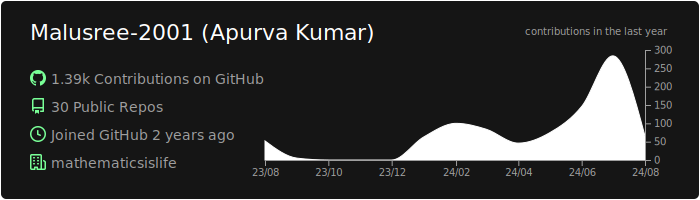
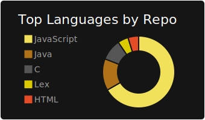
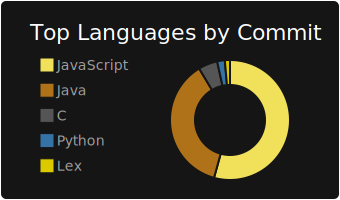
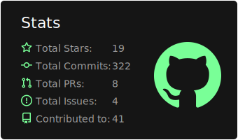
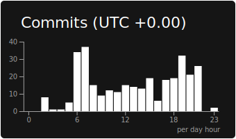

## dark

[](https://github.com/avanthikapradeep367-eng/avanthikapradeep367-eng)
[](https://github.com/avanthikapradeep367-eng/avanthikapradeep367-eng) [](https://github.com/avanthikapradeep367-eng/avanthikapradeep367-eng)
[](https://github.com/avanthikapradeep367-eng/avanthikapradeep367-eng) [](https://github.com/avanthikapradeep367-eng/avanthikapradeep367-eng)
### Now you can add this to your markdown
```

[](https://github.com/avanthikapradeep367-eng/avanthikapradeep367-eng)
[](https://github.com/avanthikapradeep367-eng/avanthikapradeep367-eng) [](https://github.com/avanthikapradeep367-eng/avanthikapradeep367-eng)
[](https://github.com/avanthikapradeep367-eng/avanthikapradeep367-eng) [](https://github.com/avanthikapradeep367-eng/avanthikapradeep367-eng)

```

### Each card usage
---


```

```

    

---


```

```

    

---


```

```

    

---


```

```

    

---


```

```

    
